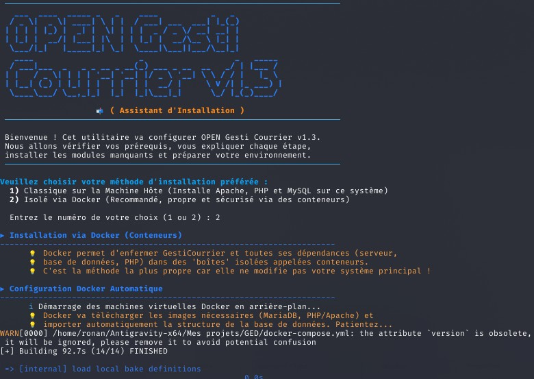

# OPEN Gesti Courrier v1.3 📬


## Présentation de la GED
**OPEN Gesti Courrier** est un système de gestion électronique de documents (GED) moderne et open source, spécialement conçu pour la gestion optimisée, centralisée et sécurisée des correspondances d'une organisation. 

L'application permet d'enregistrer, de suivre, d'archiver et de purger légalement les courriers entrants et sortants au sein d'une interface utilisateur intuitive et réactive. Elle vise à dématérialiser complètement le traitement administratif tout en assurant une traçabilité rigoureuse.

---

## Configuration et prérequis
Cette application est architecturée pour fonctionner de manière optimale sur des serveurs **Linux**. 

Les distributions recommandées et officiellement supportées sont :
- **Debian** (11 Bullseye, 12 Bookworm ou supérieur)
- **Ubuntu** (20.04 LTS, 22.04 LTS, 24.04 LTS)

---

## Technologies utilisées
L'application repose sur un socle technologique robuste, éprouvé et facile à maintenir :
- **Backend :** PHP (orienté procédural et objet léger)
- **Base de données :** MySQL / MariaDB
- **Frontend :** HTML5, CSS3, JavaScript (vanilla JS), Bootstrap
- **Génération de documents :** FPDF (génération dynamique de certificats et rapports PDF)
- **Infrastructure serveur :** Apache2 ou Nginx
- **Conteneurisation :** Docker et Docker Compose (déploiement isolé)

---

## Comment l'installer
Gesti Courrier propose un utilitaire d'installation en ligne de commande ultra-intuitif et interactif en script shell (avec un magnifique en-tête en art ASCII), qui gère automatiquement la détection et l'installation de toutes les dépendances.

1. **Cloner le dépôt sur votre serveur :**
   ```bash
   git clone <votre-url-github>
   cd GestiCourrier
   ```

2. **Lancer l'assistant d'installation (nécessite les privilèges super-utilisateur) :**
   ```bash
   chmod +x install.sh
   sudo ./install.sh
   ```

   

3. **Suivre le guide interactif :**
   L'assistant vous demandera de choisir entre deux méthodes de déploiement :
   - **Machine hôte (classique) :** l'outil installe automatiquement Apache, les extensions PHP manquantes et MariaDB directement sur votre système, tout en configurant les droits d'accès sécurisés (`www-data`).
   - **Docker (recommandé) :** isole l'application et la base de données dans des conteneurs via Docker Compose, en configurant automatiquement le fichier d'environnement.

---

## Fonctionnalités détaillées
OPEN Gesti Courrier propose un ensemble complet de modules pensés pour les flux de travail professionnels :

### 📥 Gestion des courriers entrants
- **Enregistrement et indexation :** numérotation chronologique, date de réception, sélection de l'expéditeur via l'annuaire, et définition de l'objet du courrier.
- **Catégorisation :** classement précis par types (facture, lettre recommandée, circulaire, etc.) pour des statistiques claires.
- **Gestion des pièces jointes :** téléversement sécurisé des fichiers liés au courrier (PDF, Word, Excel, images) sur le serveur.
- **Statut de traitement :** suivi visuel du cycle de vie du courrier (à traiter, en cours, clôturé).

### 📤 Gestion des courriers sortants
- **Liaison intelligente « entrant-sortant » :** capacité unique de lier un courrier sortant (réponse) à un courrier entrant spécifique, générant ainsi un historique complet de correspondance.
- **Carnet de destinataires :** sélection rapide et autocomplétée depuis les contacts enregistrés.
- **Suivi des expéditions :** date d'envoi, nature du courrier envoyé et fichiers associés.

### 📇 Annuaire des contacts centralisé
- Base de données unifiée des expéditeurs et destinataires fréquents.
- Modules de création, modification, et recherche instantanée pour fluidifier la saisie documentaire.

### 🔍 Moteur de recherche et tableaux de bord
- **Recherche multi-critères :** filtrez instantanément la base par mots-clés, expéditeur/destinataire, plages de dates, ou catégories.
- **Rapports complets :** les tableaux de résultats (exportables en PDF, Word, Excel) affichent désormais dynamiquement le nombre de documents/fichiers liés à chaque enregistrement.

### ⚙️ Paramétrage et administration
- **Gestion dynamique des catégories :** les administrateurs peuvent créer et éditer la liste des catégories de courriers selon les besoins de leur structure.
- **Sauvegarde globale :** module permettant la génération et le téléchargement d'archives compressées (ZIP) contenant une sauvegarde SQL intégrale, protégeant ainsi l'organisation contre la perte de données.
- **(Fonctionnalité à venir) Restauration système :** restauration instantanée d'une sauvegarde existante.
- **(Fonctionnalité à venir) Verrouillage de la saisie :** système de prise de contrôle exclusif empêchant la modification simultanée des données par plusieurs collaborateurs.

### ⚖️ Module de purge légale (conformité RGPD)
- **Purge réglementaire :** mécanisme de suppression automatisée et définitive des données obsolètes selon des durées de conservation personnalisables (ex. : 3 ans, 4 ans, 5 ans).
- **Cohérence structurelle :** l'algorithme vérifie en temps réel les liens entre courriers entrants et sortants. Il empêche la destruction isolée d'un courrier s'il fait partie d'une chaîne de correspondance dont une partie doit encore être conservée.
- **Sélection manuelle :** liste récapitulative pré-cochée permettant aux opérateurs d'exclure ponctuellement certains courriers sensibles ou historiques de la destruction de masse.
- **Traçabilité et preuve juridique :** à l'issue de chaque session de purge, le système consigne l'opération dans un journal d'audit immuable (`destruction_logs`). Il génère instantanément un certificat de destruction au format PDF attestant de la date, de l'heure, de l'opérateur responsable et listant exhaustivement les références des courriers détruits et purgés du serveur.
